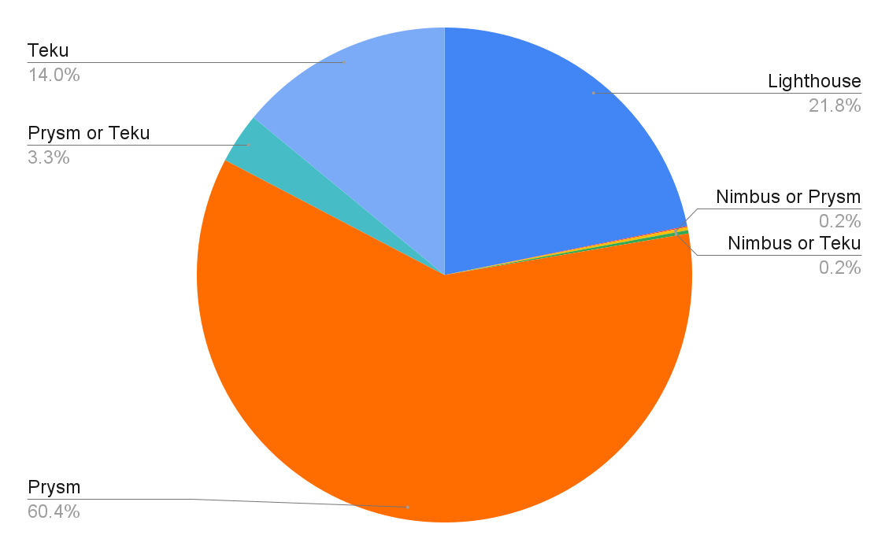

# `blockprint`

This is a repository for discussion and development of tools for Ethereum block
fingerprinting.

The primary aim is to measure beacon chain client diversity using on-chain
data, as described in this tweet:

https://twitter.com/sproulM_/status/1440512518242197516

The latest estimate using the improved k-NN classifier for slots 2048001 to 2164916 is:



## Getting Started

The raw data for block fingerprinting needs to be sourced from Lighthouse's `block_rewards` API.

This is a new API that is currently only available on the `block-rewards-api` branch, i.e. this
pull request: https://github.com/sigp/lighthouse/pull/2628

Lighthouse can be built from source by following the instructions [here][lighthouse_src].

[lighthouse_src]: https://lighthouse-book.sigmaprime.io/installation-source.html

## VirtualEnv

All Python commands should be run from a virtualenv with the dependencies from `requirements.txt`
installed.

```
python3 -m venv venv
source venv/bin/activate
pip install -r requirements.txt
```

## k-NN Classifier

The best classifier implemented so far is a k-nearest neighbours classifier in `knn_classifier.py`.

It requires a directory of structered training data to run, and can be used either via a small
API server, or in batch mode.

You can download a large (886M) training data set [here][training_data].

[training_data]: https://drive.google.com/file/d/1FZcaMLghuaPYIqTU98mL7d4KW0EDeN9l

To run in batch mode against a directory of JSON batches (individual files downloaded from LH),
use this command:

```
./knn_classifier.py training_data_proc data_to_classify
```

Expected output is:

```
classifier score: 0.9886800869904645
classifying rewards from file slot_2048001_to_2050048.json
total blocks processed: 2032
Lighthouse,0.2072
Nimbus or Prysm,0.002
Nimbus or Teku,0.0025
Prysm,0.6339
Prysm or Teku,0.0241
Teku,0.1304
```

## Training the Classifier

The classifier is trained from a directory of reward batches. You can fetch batches with the
`load_blocks.py` script by providing a start slot, end slot and output directory:

```
./load_blocks.py 2048001 2048032 testdata
```

The directory `testdata` now contains 1 or more files of the form `slot_X_to_Y.json` downloaded
from Lighthouse.

To train the classifier on this data, use the `prepare_training_data.py` script:

```
./prepare_training_data.py testdata testdata_proc
```

This will read files from `testdata` and write the graffiti-classified training data to
`testdata_proc`, which is structured as directories of _single_ block reward files for each
client.

```
$ tree testdata_proc
testdata_proc
├── Lighthouse
│   ├── 0x03ae60212c73bc2d09dd3a7269f042782ab0c7a64e8202c316cbcaf62f42b942.json
│   └── 0x5e0872a64ea6165e87bc7e698795cb3928484e01ffdb49ebaa5b95e20bdb392c.json
├── Nimbus
│   └── 0x0a90585b2a2572305db37ef332cb3cbb768eba08ad1396f82b795876359fc8fb.json
├── Prysm
│   └── 0x0a16c9a66800bd65d997db19669439281764d541ca89c15a4a10fc1782d94b1c.json
└── Teku
    ├── 0x09d60a130334aa3b9b669bf588396a007e9192de002ce66f55e5a28309b9d0d3.json
    ├── 0x421a91ebdb650671e552ce3491928d8f78e04c7c9cb75e885df90e1593ca54d6.json
    └── 0x7fedb0da9699c93ce66966555c6719e1159ae7b3220c7053a08c8f50e2f3f56f.json
```

You can then use this directory as the first argument to `./knn_classifier.py`.

## Classifier API

With pre-processed training data installed in `./training_data_proc`, you can
host a classification API server like this:

```
gunicorn --reload api_server --timeout 1800
```

It will take a few minutes to start-up while it loads all of the training data into memory.

```
Initialising classifier, this could take a moment...
Start-up complete, classifier score is 0.9886800869904645
```

Once it has started up, you can make POST requests to the `/classify` endpoint containing
a _single_ JSON-encoded block reward. There is an example input file in `examples`.

```
curl -s -X POST -H "Content-Type: application/json" --data @examples/single_teku_block.json "http://localhost:8000/classify"
```

The response is of the following form:

```json
{
  "block_root": "0x421a91ebdb650671e552ce3491928d8f78e04c7c9cb75e885df90e1593ca54d6",
  "best_guess_single": "Teku",
  "best_guess_multi": "Teku",
  "probability_map": {
    "Lighthouse": 0.0,
    "Nimbus": 0.0,
    "Prysm": 0.0,
    "Teku": 1.0
  }
}
```

* `best_guess_single` is the single _most probable_ guess of the client this block was proposed
   by.
* `best_guess_multi` is a list of 1-2 client guesses. If the classifier is more than 95% sure
   of a single client then the multi guess will be the same as `best_guess_single`. Otherwise
   it will be a string of the form "Lighthouse or Teku" with 2 clients in lexicographic order.
   3 client splits are never returned.
* `probability_map` is a map from each known client label to the probability that the given block
   was proposed by that client.

## TODO

- [x] Improve the classification algorithm using better stats or machine learning (done, k-NN).
- [x] Decide on data representations and APIs for presenting data to a frontend (done).
- [x] Implement a web backend for the above API (done).
- [ ] Polish and improve all of the above.
