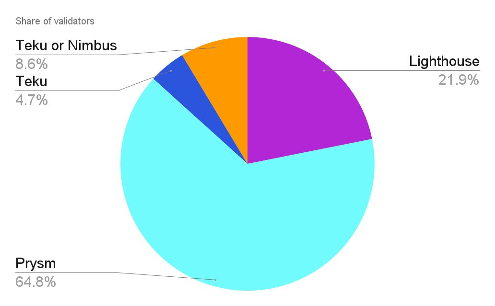

# `blockprint`

This is a repository for discussion and development of tools for Ethereum block
fingerprinting.

The primary aim is to measure beacon chain client diversity using on-chain
data, as described in this tweet:

https://twitter.com/sproulM_/status/1440512518242197516

## Getting Started

The raw data for block fingerprinting needs to be sourced from Lighthouse's `block_rewards` API.

This is a new API that is currently only available on the `block-rewards-api` branch, i.e. this
pull request: https://github.com/sigp/lighthouse/pull/2628

Lighthouse can be built from source by following the instructions [here][lighthouse_src].

[lighthouse_src]: https://lighthouse-book.sigmaprime.io/installation-source.html
