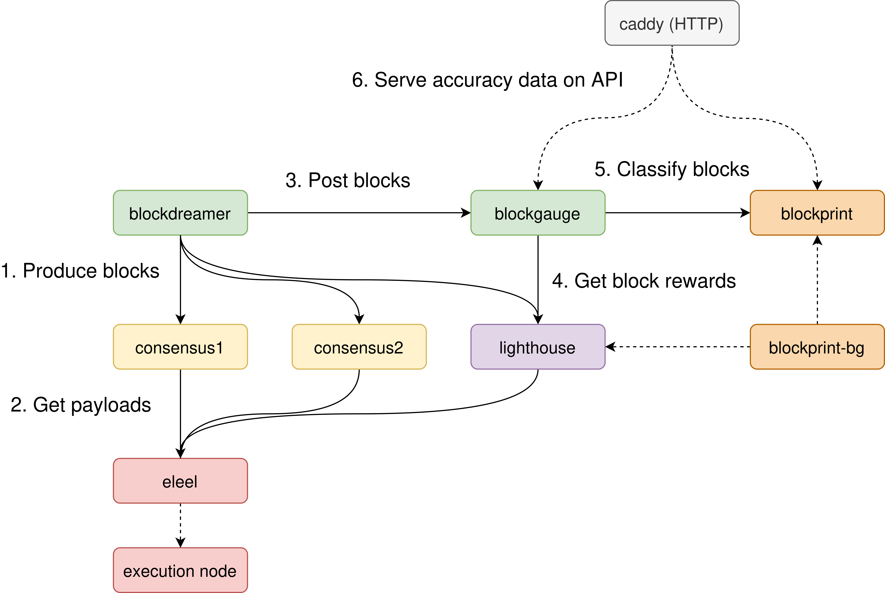

Running blockprint in production
================================

This document describes the architecture we use to run blockprint in production.

The **required** components are:

- [`blockprint`][blockprint]: Machine-learning classifier and webserver. This is where the model is
  loaded, and where the sqlite block database is modified.
- [`blockprint-bg`][blockprint-bg]: Daemon that runs alongside `blockprint` and feeds it the latest
  blocks from the canonical chain. This daemon will also heal any _gaps_ in the database caused by
  periods of downtime.
- [`lighthouse`][lighthouse]: Lighthouse computes the _block reward_ data for each block, which is
  what `blockprint` uses for classification. It is also used by `blockprint-bg` to track the
  canonical chain.

If measuring `blockprint`'s accuracy is desired (recommended), then the following **optional**
services enable that:

- [`blockdreamer`][blockdreamer]: Blockdreamer triggers block production on a collection of
  consensus clients. It builds a block using each client and then posts that block to a configured
  endpoint (`blockgauge`). It can also be configured to store the responses (block rewards) for
  each block, which can later be used to train new models.
- [`blockgauge`][blockgauge]: Blockgauge keeps track of `blockprint`'s accuracy and is responsible
  for classifying blocks received from `blockdreamer`. It exposes an HTTP endpoint for
  `blockdreamer` to POST to, and sends every block received to Lighthouse to be converted into
  block reward JSON. It then POSTs each block reward JSON to `blockprint` to receive a
  classification. It stores the classification from `blockprint` (in-memory) and provides a
  `/confusion` HTTP API to display information on false positives, false negatives, etc.
- `consensus1`, `consensus2`, etc: Consensus clients that `blockdreamer` uses for block production.
   We run 2 nodes for each client: one subscribed to all subnets, and one subscribed to default
   subnets. The reason being that clients tend to produce substantially different (better) blocks
   when subscribed to all subnets.
- [`eleel`][eleel]: Electric Eel is a _multiplexer_ that allows a single execution node to be shared by
  multiple consensus clients. This makes it easier to run multiple consensus nodes. Additionally
  `eleel` has the ability to rapidly build dummy execution payloads, which the consensus clients
  include in their dummy blocks produced by `blockdreamer`.

## Running `blockprint`

TODO

## Running `blockprint-bg`

TODO

## Running `blockdreamer`

TODO

## Running `blockgauge`

TODO

## Running `eleel`

TODO

## Required Lighthouse APIs

It isn't (currently) possible to substitute the central Lighthouse instance for another consensus
client. We require the following custom APIs which are Lighthouse-specific:

- [`GET /lighthouse/analysis/block_rewards`][get_block_rewards]: This endpoint produces block
  reward JSON for a range of blocks _from the canonical chain_. Used by `blockprint-bg`.
- [`POST /lighthouse/analysis/block_rewards`][post_block_rewards]: This endpoint produces block
  reward JSON for a list of blocks `POST`ed to the endpoint. Used by `blockgauge`.

[blockprint]: https://github.com/sigp/blockprint/blob/main/api_server.py
[blockprint-bg]: https://github.com/sigp/blockprint/blob/main/background_tasks.py
[lighthouse]: https://github.com/sigp/lighthouse
[blockdreamer]: https://github.com/blockprint-collective/blockdreamer
[blockgauge]: https://github.com/blockprint-collective/blockgauge
[eleel]: https://github.com/sigp/eleel

[get_block_rewards]: https://lighthouse-book.sigmaprime.io/api-lighthouse.html#lighthouseanalysisblock_rewards
[post_block_rewards]: https://github.com/sigp/lighthouse/blob/2841f60686d642fcc0785c884d43e34e47a800dc/beacon_node/http_api/src/lib.rs#L4279-L4294
